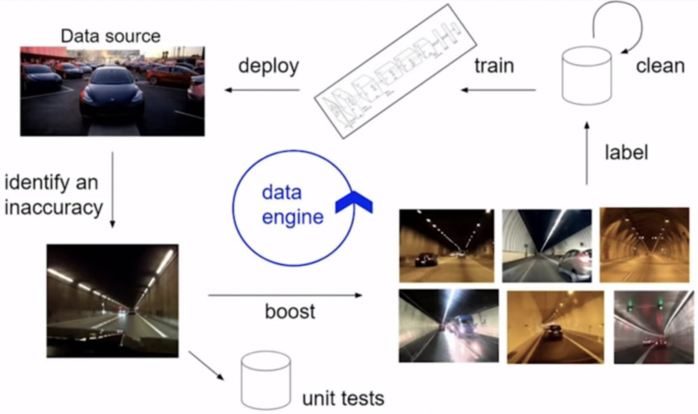
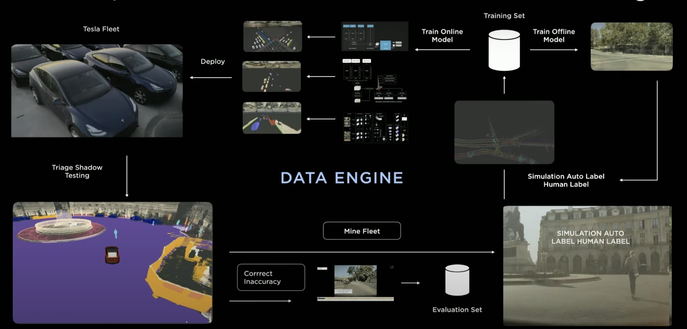

# LK Viewer

## 🚀 Quick Start (v1 - Python → Viewer)

**Phase 1 Implementation:** Reactive viewing with auto-reload

```bash
cd lk_viewer
pip install -r requirements.txt
python viewer_server.py
# Open http://localhost:8000
# Edit simple_rr_robot.py and watch it update live!
```

**Files:**
- `simple_rr_robot.py` - Example robot description
- `viewer_server.py` - FastAPI server with WebSocket & file watching
- `viewer.html` - Three.js 3D viewer
- `QUICKSTART.md` - Detailed usage guide
- `IMPLEMENTATION_SUMMARY.md` - Architecture details

---

## Key Ideas:

We want to be able to describe the entire system

Not just the robot it self

but the entire data pipline





I was inspired by seeing the roboflow workflows

My desire is to deploy a fully autonmous self learning system, not just the system its self. All of that infastructure around it needs to be managed, so might as well try to do that in one single unified way.

Can we describe the entire system in terms on (systems, sub-systems, nodes, components, sub-components?) If yes, then we can have one ground source of truth for the entire system where system can now be at a very high business level.

What could you achieve if you had the right tools to simplify data in the right way?

- There are many parts in a system not just what you think of as the "product"
- UIs for customers, Databases, Cloud workflows, 
- I think all the complexity then is essentially in the implementation of thoose components...
- The communications could be completely cross modal, some are in dora rs, some in ros, some in https, etc. it also shouldn't matter at that system design point of view...
- Visual is great for the Human but not so great for the AI, python I think is great for the ai though :)

 


Awesome Features:

- Bidirection editing of system architecture and reactive visuzlation
    - Editing the Graph and 3D models, etc. update the code. Editing the code updates the viz, all in real time
    - Including URDF 
- Edit and Live Mode and Deploy Mode. In edit you can make adjustments etc. Then as easy as running a python script you can launch the entire system.
    - Manges bring up/shut down automatically. Option for "dynamic" nodes which lets you more quickly iterate. Some nodes act more like servers and need to continue running. this is like doing ros launch and then making a client to it. No worries all of this is abstracted away!
    - In deploy mode, its like when its at a customer facility
        - In the diagonsitics view, you can see a high level health overview of each component in the system (green ok, yellow warning, red error)
        - You can stop/start the system
        - You can "connect" to a deployed system and bring up its information (essentially this loads in its system configuration)
- OTA updates.
    - You can continue to edit the graph and deploy live to customer sites
- Really I think this now a tool for system design. for complex, autonmous, data driven software/hardware systems.

Like Keras - Design tools for complex, autonmous, data driven software/hardware systems (aka Robots)

Context:

We have a very hard problem we want to solve for which robots are well suited for. Waste sorting, affordable housing & construction, national & international security, green energy infastructure, sustainble agriculture, empowering small businesse owners, elder care, health care, disaster response, self driving cars.

Developing such a system is very challenging. 

Idea:

[Open features.md](cursor://file//home/bam/bam_ws/src/like_keras/lk/msgs/diagnostics.py)


- Were possible, instead of creating a complete system and launching it. (Like Nasa working ~10 years on the Apollo project). We want to develop a simpler system with the capability to grow/learn/scale into the full system

> Instead of trying to produce a program to simulate the adult mind, why not rather try to produce one which simulates the child’s? If this were then subjected to an appropriate course of education one would obtain the adult brain. - Alan Turing

- This idea I think not only applies to high level ai software (computer vision, grasping) but even lower level functinos like dynamics/control etc that you traditionally model, then calibrate, and hand tune. 
- With AI, it becomes even more powerful to focus on a top down approach as it is able to help implement the details bottom up. We can specific what we want, what success looks like, and the AI can then fill in the blanks to that spec. The more specific we can define what we want the better, and the better our success metrics/tests the better result we will get. 
- Can we describe the entire system we want, the robot, the systems of robots, the customer facing apps, the data pipelines, all in a single unified language and spot?

> "In the age of AI, just ask for what you want, and the AI can deliver" - Eric Jang

- Does what we want come from top down, or from being in the details? Even if its a flow of both, even if its an iterative process, I think we can benefit from having powerful top down tools
- What if you could describe exactly what you want. The system design for a number of key uses cases, and then the AI can jointly optimize and implement all of these use cases with a single code base. 


Similar System Design Tools:

- [AICA](https://www.aica.tech/product) (Enrico's Company)
https://docs.aica.tech/docs/getting-started/studio/editor
- https://www.youtube.com/watch?v=EDWrMFKJu_c

- Complex concepts are depicited in a concise and accurate way
- You can see the transition of the real robotics system, it shows what is active an inactive
- You can Pause/Stop/Restart the sytem

I like:
- The ability to start and stop with easy to access buttons
- How it shows the state of each component (active, inactive, etc)
- How it shows which edges have data flowing in them
- How it shows the inputs and outputs to each system
- How you can configure the component with a click of a button (Here is the super key thing!)
    - You actually don't want to be exploring a file, and folder. Its not an efficient way to organize and think about such a system. Graphically I think we can understand this complex info much better. Its like constrainting your self to think about it in a very linear way, instead of a systems way.. crazy
- In their new system
- ability to view 3D and graph side by side
- ability to hide edges and use sub graphs, sub components to manage complexity

- I do actually like Yaml as the internal repsentation is very clean and easy to read.
- My issue with yaml is that its hard to edit, python config is like xacro + urdf
- But if you want a common itnerface language than yaml seems cool actually.
- Would be nice to a a graph view, yaml view (basiically never use, like looking at raw source), python view

I don't like the path editing
- I think that should be mostly automated basically or be like miro...

Intrisic Flow State:

https://www.intrinsic.ai/architecture

What I like:
- Developer view and Operator view. Considering this from the fron is awesome
    - Unified platform for both. Its a great idea, making that customer UI should be easy!

- Focus on digital twin. Seems super powerful of course.. even for instrospection of the system..
    - It would be great if I can just connect to the system, "fly around" the scene with all the robots moving, interacting. I essentially want to do this during dev though...
    - This seems central to their software at the top of the code they have a drop down for real hardware/vs sim. I like how they put that there
    - IntristicOS powers your solutions both virtuall and ol real hardware using same software stack. That is cool! I can imagine deployed the robot to a cloud server, but just mocking the hardware interface.
    - Collision sim, physics sim?
- I really like the scene graph for their 3d scene, with the tree (kinda like viser)
- I like ability to view camera view points, and robot workspaces/reachability analysis in order to position the robots. I can see how you can really make it easy to build these complex applications.. 
- I like the bahviour tree 
- I really like the full digital twin, with securit camera view to see the actual system
- It seems you can have multiple systems that you can start and stop seperatly which is cool
- There layout seems well organize with drop downs to hide and expand nodes easily

- Focus on deployment, I think is great, its all integrated
- I like the window view of the trajectory data
- I like the top drop down menu + (add frame, add asset, import geometry, search by name)
- Its interesting when you add that hardware you are also adding all the control software and interface as well...
- Add hardware virtually, positon your hardware (measure distance, test rechability, check collisions) I like how the hardware is rendered with color meshesh
- Develop process with python,c++ or graphical UI.
- I like how when adding components you have a search bar and also scrollable drop down
- Seems like a super well considered UI and drop down menus and bars
- Skills, Control flow, transition. Interesting this is much higher level that I am imaging...
- I want to be be able to basically program the components as well... mabye you should just use python for this, like dora? Ok I feel this is like a behaviour tree editor. which has much more complicated conditions.. than dataflow read or write. I think I could have a subgraph behaviour tree which have very different controls within.. Essentially like a flow state within lol. I can start with just python programming it though for now.
- I really like this idea of validate in simulation, and then fine tune on real hardware. This is exactly how I imagine deploying to new facilities. Set up the system, 
- Back end (Real, Collision Sim, Mujoco Sim, Gazebo Sim, etc.)


I don't like:
- How they made their own OS, etc. I wonder if they could have used balena to do seamless deployment, or leveraged existing tools. I guess I have no option cause I don't understand that.. lol


Moveit Pro:

https://docs.picknik.ai/

- I like:

    - The toggle in the top left to switch between build anad run, the controls in the right to stop motion or teloperate
    - Right now I am seeing a stream from mujoco
    - They have the option to add favorite actions in the top, like joint diagoinstics, etc.
    - They organize it by applications that you can go thoruhg. Interesting I guess these are like subtrees that they are clicking. Ok I like the subtree library view that you can just execute and view thoose subpress, Very powerful
    - They have their idea of robot configs, which kinda seem to describe the scene..
    - The ability to auto launch new tabs in web browser but also the option to turn off the new broaswer feature
    - INteresting how they just draw like a single line between the component but then have seperate drop down for the in and out. So you don't get a line for each port.. This is perhaps more elegant but perhpas easy tos witch between multi port or single..
    - Very cool, from the drop down you can slect the model path, everything, you are essentially have access to all the configuration panel form there.. wow this is so powerful... 
    - I Lovveeee the waypoint teleropation.. 
    - The ability to add breakpoints to the graph

- I don't like:
    - How its not cloud based, you need to install on to the comoputer. Yuck!
    - No it is browser based
        - Makes sense mabye for deployment? but not dev imo...

- Could be nice to switch between left to right or top to down viewing
- Ah ok its the runtime you are installing


Roboflow Workflow:
- https://docs.roboflow.com/workflows/what-is-workflows


References:

- [[CVPR'21 WAD] Keynote - Andrej Karpathy, Tesla](https://www.youtube.com/watch?v=g6bOwQdCJrc)
- [Andrej Karpathy - AI for Full-Self Driving at Tesla](https://www.youtube.com/watch?v=hx7BXih7zx8)
- [rl at scale](https://rl-at-scale.github.io/)


- I am making the tool to make the system, super cool :)

Ok I see three posibilties

----
Ability to link to and bring up documentation within each component view
- Display rich markdown text
- Link to product feature page, etc, versino control, change log
- Can be complete data mangement


STart simple,

Generic way to do bideriectionals views. The nesting is super importantant.

Development point of view and hardware is different and may be different. For example some of the sub components may be shared...

https://en.wikipedia.org/wiki/4%2B1_architectural_view_model


Important Views:

1. (Engineer view) Python View (.py)
2. (machine view) Config File view (.yaml/.json) (What you generate from the python, sufficent to reconstruct )
3. (Systems designer view) Component view shows the parts of the system and how they connect
4. Node view shows the indepdent proccesses that the components are running on and the hardware thoose nodes are located on
5. 
3. Customer/Operator view (its very related to the programmer/develoepr view)
5. Product manager (pm) view, super duper important, what you almost compile into everything else, very related to the usecases
6. Reminds me of click up having the different views on the same data...


The data which describes the system is the same we just want to view it in different ways...


Auto update vs update on save..